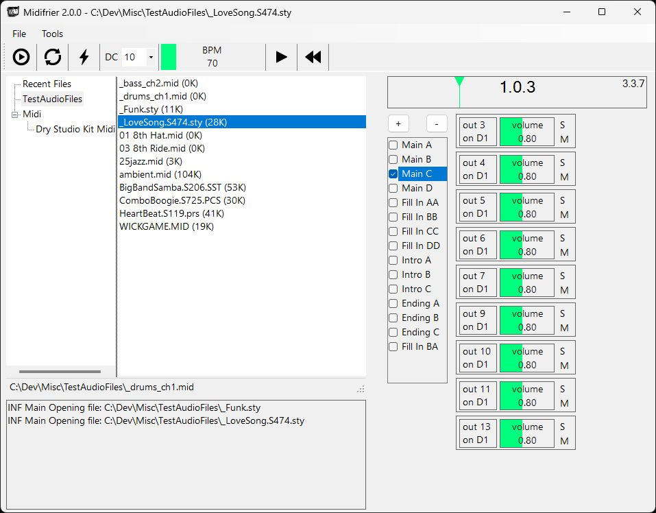

# Midifrier

- Open and play midi files.
- Open and play the patterns in Yamaha style files.
- Remap channel patches.
- Export subsets of input files.

- VS2022 and .NET8.

## Usage

- The simple shows a tree directory navigator on the left and standard audio transport
  family of controls on the right.
- Open style files and play the individual patterns.
- Export current pattern(s) and channel(s) to new midi files (type 1). Useful for snipping style patterns.
    - If input is a plain midi file, output will be 1 pattern, with 1-N tracks, each with 1-N channels.
    - If input is a midi style file, output will be 1-N patterns, each with 1 track, each with 1-N channels.
- Export to csv or readable text.
- Dump verbatim file contents.
- Some midi files (particuarly single instrument) don't use 10 for drum channel so there is an option to remap.
- Click on the settings icon to edit your options. Note that not all midi options pertain to this application.
- In the log view: C for clear, W for word wrap toggle.

## Style Files
Style files contain multiple sections, each of which describes a pattern.

The order of the sections in the file is at follows:
- Midi section (type 0)
  - MThd
  - MTrk
  - SFF1/2
  - SInt
  - Markers - delineate the pattern notes
  - EndTrack
- CASM section - proprietary logic for using the patterns - ignored
- OTS (One Touch Setting) section - ignored
- MDB (Music Finder) section - ignored
- MH section - ignored

Detail is in http://www.wierzba.homepage.t-online.de/StyleFileDescription_v21.pdf.

There's tons of styles and technical info at https://psrtutorial.com/.

And http://www.jososoft.dk/yamaha/articles.htm.

# External Components

- [NAudio](https://github.com/naudio/NAudio) (Microsoft Public License).
- Application icon: [Charlotte Schmidt](http://pattedemouche.free.fr/) (Copyright © 2009 of Charlotte Schmidt).
- Button icons: [Glyphicons Free](http://glyphicons.com/) (CC BY 3.0).
